- 🔄 Coming from 4 years in IT support & operations, **now building the systems I used to support.**
- 🎓 **Software Engineering Bachelor @ESGI**, 2nd year apprenticeship track, heading into an **[Artificial Intelligence and Big Data specialization](https://www.esgi.fr/programmes/intelligence-artificielle-big-data.html)**.
- 📚 **[The Odin Project](https://www.theodinproject.com/)**: A renown self-taught full-stack path since late 2025.
- 📄 **[myPDFConfigurator](https://github.com/thomastbl/myPDFConfigurator)**: a React + Go (Gin) app with a Python AI layer to assist decision-making.
- ⚡ **[Real-time multiplayer server](https://github.com/thomastbl/multiplayer-websocket-server)**: Express API with JWT auth plus a WebSocket server that handles user authentification, presence and live broadcasting.

**Daily use**

**Learning now**

**Concepts:** `HTTP & REST APIs` `Authentification & Security` `Tests` `React (Hooks & State)` `Docker & CI/CD` `SQL` `Caching` `Structured Outputs` `RAG`

<table width="100%">
  <tr>
    <td width="50%" valign="top">
      <h3>⚡ <a href="https://github.com/thomastbl/multiplayer-websocket-server">Real-time Multiplayer Server</a></h3>
      
Multiplayer server with its web UI, built in vanilla JavaScript (ES Modules, CSS Grid/Flexbox, design tokens). The Node.js back end splits an <b>Express/HTTP server</b> (JWT auth with route-protection middleware, bcrypt, PostgreSQL with parameterized queries) from a <b>WebSocket server</b> that authenticates connections, tracks online users via heartbeat and broadcasts updates in real time.

      
    </td>
    <td width="50%" valign="top">
      <h3>📄 <a href="https://github.com/thomastbl/myPDFConfigurator">myPDFConfigurator</a> 🚧 in progress</h3>
      
PDF configuration app where an AI layer supports the decision-making process. React front end, REST API in Go with Gin, a Python service for the AI part, PostgreSQL for storage, and a repo structured along best practices from day one.

      
    </td>
  </tr>
  <tr>
    <td width="50%" valign="top">
      <h3>🅿️ <a href="https://github.com/JOYCE185/FIND-YOUR-SPOT-ESGI">Find Your Spot</a></h3>
      
ESGI team project: a web app with an interactive map to locate parking spots, with markers and detail popups. Users can interact with each other by updating parking status about free spots.

      
    </td>
    <td width="50%" valign="top">
    </td>
  </tr>
</table>

<i>📫 Looking for a 2-year apprenticeship in back-end / full-stack development (Aix-Marseille area or Paris area). Let's talk!</i>

